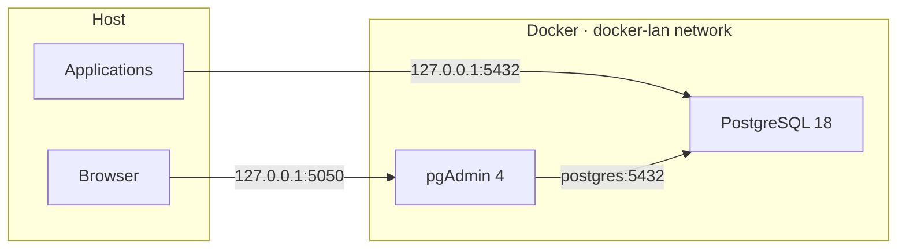

<div align="center">

# docker-postgres

**Production-ready PostgreSQL + pgAdmin stack on Docker Compose**

A production-oriented environment with hardened security defaults, health checks, backups, and a convenient Makefile for day-to-day operations.

<br>

[](https://www.postgresql.org/)
[](https://www.pgadmin.org/)
[](https://docs.docker.com/compose/)
[](LICENSE)

<br>

[Quick Start](#-quick-start) ·
[Features](#-features) ·
[Operations](#-operations) ·
[Production](#-production-setup)

</div>

---

## Overview

A minimal yet complete Docker stack for running **PostgreSQL 18** with the **pgAdmin 4** web UI. Security-first by default: ports bound to `127.0.0.1`, `scram-sha-256` authentication, and an explicit `pg_hba.conf` that rejects external connections.



| Service | Address | Purpose |
|---------|---------|---------|
| **PostgreSQL** | `127.0.0.1:5432` | Primary database |
| **pgAdmin** | http://127.0.0.1:5050 | Web administration UI |

---

## Quick Start

### Requirements

- [Docker](https://docs.docker.com/get-docker/) 24+
- [Docker Compose](https://docs.docker.com/compose/) v2
- `make`, `openssl` (for password generation)

### Installation

```bash
git clone https://github.com/iSmartyPRO/docker-postgres.git
cd docker-postgres

make setup   # .env with passwords + pgAdmin auto-configuration
make up      # start containers
```

| Command | Action |
|---------|--------|
| `make setup` | Creates `.env`, generates passwords, configures pgAdmin |
| `make up` | Creates the `docker-lan` network (if missing) and starts the stack |
| `make health` | Checks PostgreSQL readiness |

pgAdmin login: email from `PGADMIN_DEFAULT_EMAIL` in `.env`.

---

## Features

<table>
<tr>
<td width="50%" valign="top">

### Database

- PostgreSQL **18.4** (Alpine), pinned image version
- Tuned `postgresql.conf` for ~2 GB RAM
- `wal_level = replica` — replication-ready
- `pg_stat_statements` extension out of the box
- Health check via `pg_isready`

</td>
<td width="50%" valign="top">

### Security & ops

- `scram-sha-256`, strict `pg_hba.conf`
- Ports bound to `127.0.0.1` only
- Memory limits, log rotation
- `no-new-privileges` for containers
- Backup / restore scripts with retention

</td>
</tr>
<tr>
<td width="50%" valign="top">

### pgAdmin

- pgAdmin **9.15** with auto-connect to PostgreSQL
- Pre-configured `servers.json` and `pgpass`
- Waits for PostgreSQL healthy status on startup

</td>
<td width="50%" valign="top">

### Infrastructure

- Named volumes (`postgres_data`, `pgadmin_data`)
- External `docker-lan` network for integration with other stacks
- nginx reverse proxy examples (dedicated domain and subpath)

</td>
</tr>
</table>

---

## Project Structure

```
docker-postgres/
├── docker-compose.yml          # Service orchestration
├── Makefile                    # Operational commands
├── .env.example                # Environment variable template
│
├── config/
│   ├── postgresql.conf         # PostgreSQL settings
│   ├── pg_hba.conf             # Access rules
│   └── pgadmin/                # pgAdmin auto-config (generated)
│
├── init/
│   └── 01-extensions.sql       # SQL run on first startup
│
├── scripts/
│   ├── backup.sh               # Backup
│   ├── restore.sh              # Restore from backup
│   └── setup-pgadmin.sh        # pgAdmin configuration generator
│
└── nginx/
    ├── pgadmin.example.conf           # Reverse proxy on a dedicated domain
    └── pgadmin-subpath.example.conf   # pgAdmin on a subpath (/pgadmin4/)
```

---

## Operations

```bash
make ps          # container status
make health      # PostgreSQL readiness check
make logs        # live logs
make backup      # backup to backups/
make restore BACKUP=backups/app_YYYYMMDD_HHMMSS.sql.gz
make psql        # interactive psql shell
make down        # stop the stack
make pull        # pull updated images
```

### Application Connection

```
Host:     127.0.0.1          # or postgres from the docker-lan network
Port:     5432
Database: app
User:     app
Password: <from .env>
```

Connection string:

```
postgresql://app:<password>@127.0.0.1:5432/app
```

### Automated Backups (cron)

```cron
0 2 * * * cd /path/to/docker-postgres && ./scripts/backup.sh >> /var/log/postgres-backup.log 2>&1
```

Retention period is set in `.env` → `BACKUP_RETENTION_DAYS` (default: 14 days).

---

## Production Setup

| Step | Action |
|------|--------|
| **1. Passwords** | Set strong values in `.env`, or run `make env` for auto-generation |
| **2. Memory** | Tune `shared_buffers`, `effective_cache_size` in `config/postgresql.conf` |
| **3. Remote access** | Remove `127.0.0.1:` before ports in `docker-compose.yml` + configure firewall |
| **4. SSL** | Enable `ssl = on`, mount certificates into PostgreSQL |
| **5. Expose pgAdmin** | Use examples from `nginx/` with HTTPS and IP restrictions |
| **6. Replication** | `wal_level = replica` is already enabled — add a standby as needed |

---

## Upgrading

```bash
# Update versions in .env, then:
make pull
make up
```

Data is persisted in the `postgres_data` volume.

### PostgreSQL Major Version Migration

When upgrading across major versions (e.g. 16 → 18), the data directory layout changes. Safe approach:

```bash
make backup
make down
docker volume rm postgres_data   # only if backup is saved
make up
make restore BACKUP=backups/app_YYYYMMDD_HHMMSS.sql.gz
```

---

## Environment Variables

| Variable | Default | Description |
|----------|---------|-------------|
| `POSTGRES_VERSION` | `18.4-alpine` | PostgreSQL image version |
| `POSTGRES_DB` | `app` | Database name |
| `POSTGRES_USER` | `app` | Database user |
| `POSTGRES_PORT` | `5432` | Host port |
| `PGADMIN_VERSION` | `9.15` | pgAdmin image version |
| `PGADMIN_PORT` | `5050` | pgAdmin host port |
| `TZ` | `UTC` | Timezone |
| `BACKUP_RETENTION_DAYS` | `14` | Backup retention period |

Full list in [`.env.example`](.env.example).

---

## License

This project is licensed under the [MIT License](LICENSE).

---

<div align="center">

Built with ♥ for convenient and secure PostgreSQL deployments

**[iSmartyPRO](https://github.com/iSmartyPRO)**

</div>
