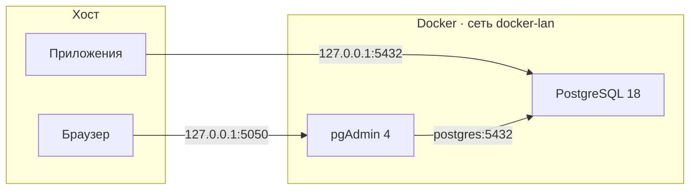

<div align="center">

# docker-postgres

**Production-ready стек PostgreSQL + pgAdmin на Docker Compose**

Готовое к продакшену окружение с жёсткой конфигурацией безопасности, health checks, бэкапами и удобным Makefile для ежедневной эксплуатации.

<br>

[](https://www.postgresql.org/)
[](https://www.pgadmin.org/)
[](https://docs.docker.com/compose/)
[](LICENSE)

<br>

[Быстрый старт](#-быстрый-старт) ·
[Возможности](#-возможности) ·
[Эксплуатация](#-эксплуатация) ·
[Продакшн](#-настройка-под-продакшн)

</div>

---

## Обзор

Минималистичный, но полноценный Docker-стек для развёртывания **PostgreSQL 18** с веб-интерфейсом **pgAdmin 4**. Проект ориентирован на безопасность по умолчанию: порты привязаны к `127.0.0.1`, аутентификация `scram-sha-256`, явный `pg_hba.conf` с отклонением внешних подключений.



| Сервис | Адрес | Назначение |
|--------|-------|------------|
| **PostgreSQL** | `127.0.0.1:5432` | Основная СУБД |
| **pgAdmin** | http://127.0.0.1:5050 | Веб-интерфейс администрирования |

---

## Быстрый старт

### Требования

- [Docker](https://docs.docker.com/get-docker/) 24+
- [Docker Compose](https://docs.docker.com/compose/) v2
- `make`, `openssl` (для генерации паролей)

### Установка

```bash
git clone https://github.com/iSmartyPRO/docker-postgres.git
cd docker-postgres

make setup   # .env с паролями + автоконфигурация pgAdmin
make up      # запуск контейнеров
```

| Команда | Действие |
|---------|----------|
| `make setup` | Создаёт `.env`, генерирует пароли, настраивает pgAdmin |
| `make up` | Создаёт сеть `docker-lan` (если нет) и поднимает стек |
| `make health` | Проверяет готовность PostgreSQL |

Вход в pgAdmin — email из `PGADMIN_DEFAULT_EMAIL` в `.env`.

---

## Возможности

<table>
<tr>
<td width="50%" valign="top">

### База данных

- PostgreSQL **18.4** (Alpine), фиксированная версия образа
- Тюнинг `postgresql.conf` под ~2 GB RAM
- `wal_level = replica` — готовность к репликации
- Расширение `pg_stat_statements` из коробки
- Health check через `pg_isready`

</td>
<td width="50%" valign="top">

### Безопасность и ops

- `scram-sha-256`, строгий `pg_hba.conf`
- Порты только на `127.0.0.1`
- Лимиты памяти, ротация логов
- `no-new-privileges` для контейнеров
- Скрипты backup / restore с retention

</td>
</tr>
<tr>
<td width="50%" valign="top">

### pgAdmin

- pgAdmin **9.15** с автоподключением к PostgreSQL
- Преднастроенный `servers.json` и `pgpass`
- Ожидание healthy-статуса PostgreSQL при старте

</td>
<td width="50%" valign="top">

### Инфраструктура

- Именованные volumes (`postgres_data`, `pgadmin_data`)
- Внешняя сеть `docker-lan` для связи с другими стеками
- Примеры nginx reverse proxy (домен и subpath)

</td>
</tr>
</table>

---

## Структура проекта

```
docker-postgres/
├── docker-compose.yml          # Оркестрация сервисов
├── Makefile                    # Команды эксплуатации
├── .env.example                # Шаблон переменных окружения
│
├── config/
│   ├── postgresql.conf         # Настройки PostgreSQL
│   ├── pg_hba.conf             # Правила доступа
│   └── pgadmin/                # Автоконфигурация pgAdmin (генерируется)
│
├── init/
│   └── 01-extensions.sql       # SQL при первом запуске
│
├── scripts/
│   ├── backup.sh               # Резервное копирование
│   ├── restore.sh              # Восстановление из бэкапа
│   └── setup-pgadmin.sh        # Генерация конфигурации pgAdmin
│
└── nginx/
    ├── pgadmin.example.conf           # Reverse proxy на отдельном домене
    └── pgadmin-subpath.example.conf   # pgAdmin на подпути (/pgadmin4/)
```

---

## Эксплуатация

```bash
make ps          # статус контейнеров
make health      # проверка готовности PostgreSQL
make logs        # логи в реальном времени
make backup      # бэкап в backups/
make restore BACKUP=backups/app_YYYYMMDD_HHMMSS.sql.gz
make psql        # интерактивная консоль psql
make down        # остановить стек
make pull        # обновить образы
```

### Подключение приложений

```
Host:     127.0.0.1          # или postgres из сети docker-lan
Port:     5432
Database: app
User:     app
Password: <из .env>
```

Строка подключения:

```
postgresql://app:<password>@127.0.0.1:5432/app
```

### Автоматические бэкапы (cron)

```cron
0 2 * * * cd /path/to/docker-postgres && ./scripts/backup.sh >> /var/log/postgres-backup.log 2>&1
```

Период хранения задаётся в `.env` → `BACKUP_RETENTION_DAYS` (по умолчанию 14 дней).

---

## Настройка под продакшн

| Шаг | Действие |
|-----|----------|
| **1. Пароли** | Задайте надёжные значения в `.env` или `make env` для автогенерации |
| **2. Память** | Настройте `shared_buffers`, `effective_cache_size` в `config/postgresql.conf` |
| **3. Удалённый доступ** | Уберите `127.0.0.1:` перед портами в `docker-compose.yml` + firewall |
| **4. SSL** | Включите `ssl = on`, смонтируйте сертификаты в PostgreSQL |
| **5. pgAdmin наружу** | Используйте примеры из `nginx/` с HTTPS и ограничением по IP |
| **6. Репликация** | `wal_level = replica` уже включён — добавьте standby при необходимости |

---

## Обновление

```bash
# Обновите версии в .env, затем:
make pull
make up
```

Данные сохраняются в volume `postgres_data`.

### Миграция major-версии PostgreSQL

При смене major-версии (например, 16 → 18) структура каталога данных меняется. Безопасный путь:

```bash
make backup
make down
docker volume rm postgres_data   # только если бэкап сохранён
make up
make restore BACKUP=backups/app_YYYYMMDD_HHMMSS.sql.gz
```

---

## Переменные окружения

| Переменная | По умолчанию | Описание |
|------------|--------------|----------|
| `POSTGRES_VERSION` | `18.4-alpine` | Версия образа PostgreSQL |
| `POSTGRES_DB` | `app` | Имя базы данных |
| `POSTGRES_USER` | `app` | Пользователь БД |
| `POSTGRES_PORT` | `5432` | Порт на хосте |
| `PGADMIN_VERSION` | `9.15` | Версия образа pgAdmin |
| `PGADMIN_PORT` | `5050` | Порт pgAdmin на хосте |
| `TZ` | `UTC` | Часовой пояс |
| `BACKUP_RETENTION_DAYS` | `14` | Срок хранения бэкапов |

Полный список — в [`.env.example`](.env.example).

---

## Лицензия

Проект распространяется под лицензией [MIT](LICENSE).

---

<div align="center">

Создано с ♥ для удобного и безопасного развёртывания PostgreSQL

**[iSmartyPRO](https://github.com/iSmartyPRO)**

</div>
