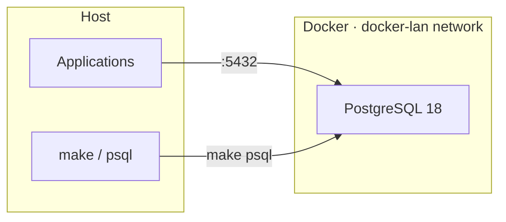

<div align="center">

# docker-postgres

**Production-ready PostgreSQL stack on Docker Compose**

A production-oriented environment with hardened security defaults, health checks, backups, and a convenient Makefile for day-to-day operations.

<br>

[](https://www.postgresql.org/)
[](https://docs.docker.com/compose/)
[](LICENSE)

<br>

[Quick Start](#-quick-start) ·
[Features](#-features) ·
[Operations](#-operations) ·
[Production](#-production-setup)

</div>

---

## Overview

A minimal yet complete Docker stack for running **PostgreSQL 18**. Password authentication via `scram-sha-256`, port `5432` exposed on all interfaces, Makefile for day-to-day operations.



| Service | Address | Purpose |
|---------|---------|---------|
| **PostgreSQL** | `0.0.0.0:5432` | Primary database |

---

## Quick Start

### Requirements

- [Docker](https://docs.docker.com/get-docker/) 24+
- [Docker Compose](https://docs.docker.com/compose/) v2
- `make`, `openssl` (for password generation)

### Installation

```bash
git clone https://github.com/iSmartyPRO/docker-postgres.git
cd docker-postgres

make setup   # .env with generated password
make up      # start PostgreSQL
```

| Command | Action |
|---------|--------|
| `make setup` | Creates `.env`, generates password |
| `make up` | Creates the `docker-lan` network (if missing) and starts PostgreSQL |
| `make health` | Checks PostgreSQL readiness |
| `make help` | Lists all available commands |

---

## Features

<table>
<tr>
<td width="50%" valign="top">

### Database

- PostgreSQL **18.4** (Alpine), pinned image version
- Tuned `postgresql.conf` for ~2 GB RAM
- `wal_level = replica` — replication-ready
- `pg_stat_statements` extension out of the box
- Health check via `pg_isready`

</td>
<td width="50%" valign="top">

### Security & ops

- `scram-sha-256` authentication
- Port `5432` on all host interfaces (`0.0.0.0`)
- Memory limits, log rotation
- `no-new-privileges` for containers
- Backup / restore scripts with retention

</td>
</tr>
<tr>
<td width="50%" valign="top">

### Makefile

- Lifecycle: `up`, `down`, `restart`, `recreate`
- SQL shell: `psql`, `sql`, `shell`
- Databases: `dbs`, `db-create`, `db-drop`, `db-size`
- Users: `users`, `user-create`, `user-drop`
- Maintenance: `vacuum`, `connections`, `extensions`

</td>
<td width="50%" valign="top">

### Infrastructure

- Named volume (`postgres_data`)
- External `docker-lan` network for integration with other stacks
- All settings driven by `.env` variables

</td>
</tr>
</table>

---

## Project Structure

```
docker-postgres/
├── docker-compose.yml          # PostgreSQL service
├── Makefile                    # Operational commands
├── .env.example                # Environment variable template
│
├── config/
│   ├── postgresql.conf         # PostgreSQL settings
│   └── pg_hba.conf             # Access rules
│
├── init/
│   └── 01-extensions.sql       # SQL run on first startup
│
└── scripts/
    ├── backup.sh               # Backup
    └── restore.sh              # Restore from backup
```

---

## Operations

Run `make help` for the full list. Common commands:

```bash
# Lifecycle
make ps              # container status
make health          # PostgreSQL readiness check
make info            # connection info from .env
make logs            # live logs
make down            # stop the stack
make pull            # pull updated images

# SQL
make psql            # interactive psql (default DB)
make psql DB=other   # psql to another database
make sql SQL='SELECT version();'

# Databases
make dbs                                    # list databases
make db-create DB=myapp                     # create database
make db-drop DB=myapp                       # drop database (with confirmation)
make db-size                                # size of default DB

# Users
make users                                  # list roles
make user-create USER=reader PASSWORD=secret
make user-drop USER=reader

# Backup
make backup                                 # backup to backups/
make backup-list                            # list backups
make restore BACKUP=backups/app_YYYYMMDD_HHMMSS.sql.gz
make restore BACKUP=backups/file.sql.gz FORCE=1   # skip confirmation

# Maintenance
make vacuum                                 # VACUUM ANALYZE
make connections                            # active connections
make extensions                             # installed extensions
```

### Application Connection

```
Host:     <host-ip>        # or postgres from the docker-lan network
Port:     5432
Database: app
User:     app
Password: <from .env>
```

Connection string:

```
postgresql://app:<password>@<host-ip>:5432/app
```

### Automated Backups (cron)

```cron
0 2 * * * cd /path/to/docker-postgres && ./scripts/backup.sh >> /var/log/postgres-backup.log 2>&1
```

Retention period is set in `.env` → `BACKUP_RETENTION_DAYS` (default: 14 days).

---

## Production Setup

| Step | Action |
|------|--------|
| **1. Passwords** | Set strong values in `.env`, or run `make env` for auto-generation |
| **2. Memory** | Tune `shared_buffers`, `effective_cache_size` in `config/postgresql.conf` |
| **3. Network** | Restrict access via firewall; tighten `config/pg_hba.conf` if needed |
| **4. Local only** | Change port mapping to `127.0.0.1:${POSTGRES_PORT}:5432` in `docker-compose.yml` |
| **5. SSL** | Enable `ssl = on`, mount certificates into PostgreSQL |
| **6. Replication** | `wal_level = replica` is already enabled — add a standby as needed |

---

## Upgrading

```bash
# Update versions in .env, then:
make pull
make up
```

Data is persisted in the `postgres_data` volume.

### PostgreSQL Major Version Migration

When upgrading across major versions (e.g. 16 → 18), the data directory layout changes. Safe approach:

```bash
make backup
make down
docker volume rm postgres_data   # only if backup is saved
make up
make restore BACKUP=backups/app_YYYYMMDD_HHMMSS.sql.gz
```

---

## Environment Variables

| Variable | Default | Description |
|----------|---------|-------------|
| `POSTGRES_VERSION` | `18.4-alpine` | PostgreSQL image version |
| `POSTGRES_DB` | `app` | Default database name |
| `POSTGRES_USER` | `app` | Database user |
| `POSTGRES_PASSWORD` | — | Database password |
| `POSTGRES_PORT` | `5432` | Host port |
| `TZ` | `UTC` | Timezone |
| `BACKUP_RETENTION_DAYS` | `14` | Backup retention period |

Full list in [`.env.example`](.env.example).

---

## License

This project is licensed under the [MIT License](LICENSE).

---

<div align="center">

Built with ♥ for convenient and secure PostgreSQL deployments

**[iSmartyPRO](https://github.com/iSmartyPRO)**

</div>
